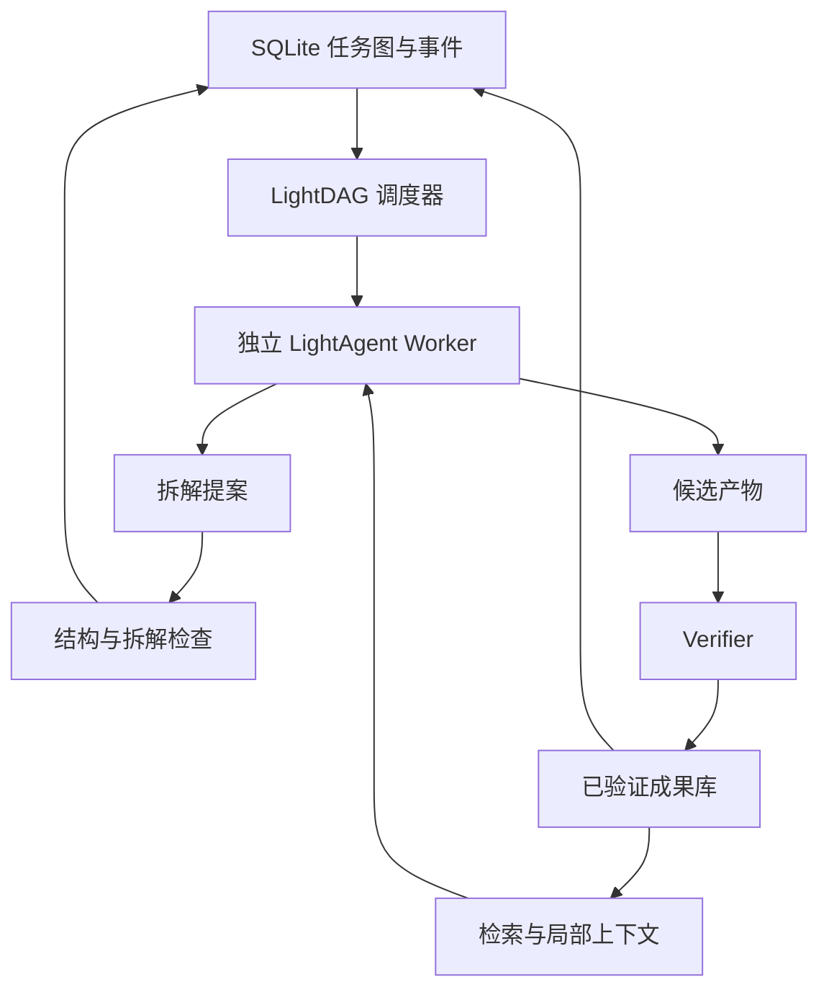

# LightAgent v0.11.0 开发方案：动态 DAG Multi-Agent 与统一安全上下文

状态：本地实现与回归测试已完成，等待 PR CI，尚未发布。编写日期：2026-09-14。实现分支：`codex/develop-v0.11.0`。

本文是 v0.10.2 之后的功能版本开发与验收指导。实现分支已提供本文所述核心协议；正式发布前仍以 PR 差异、契约测试及公共 API 清单为准。

## 1. 版本目标与范围

v0.11.0 增加可选的 `LightDAG` 运行层，让多个 LightAgent 围绕一张持久化任务图协作：执行中提出子任务、并行处理独立节点、提交候选产物、经过验证后发布成果，并在进程重启后继续工作。

首版必须跑通：

> X 尝试执行 → 提出 A/B 拆解 → 拆解检查通过 → A/B 并行 → B 验证失败并修复 → X 集成验收 → 根目标完成；任一持久化边界中断后均可安全恢复。

版本安排采用以下决策：

- v0.10.2 继续完成既定异常、取消、超时和幂等加固，不在补丁版本加入新调度体系。
- v0.11.0 合并动态 DAG 与原 roadmap 的 Unified Security Context 工作。原有 `SecurityContext`、`CapabilityGate`、`ApprovalToken`、`ProviderManifest`、权限收窄与 Job 租约要求保留。
- v0.12.0/v0.13.0 继续承担广泛的可信数据、供应链与恢复加固。DAG 自身必需的租约、权限检查、恢复和故障测试必须在 v0.11.0 完成，不能以未来版本为理由推迟。
- 实现分支已把包版本更新为 v0.11.0；v0.10.2 已于 2026-09-14 正式发布。
  v0.11.0 在 PR CI 和合并前仍视为未发布，也不改变既有安全问题的发布门禁。

### 1.1 首版交付范围

| 必须交付 | 明确边界 |
| --- | --- |
| 动态任务图 | 增加节点、复用依赖、检查环路、版本化拆解提案 |
| 并发调度 | 单机、一个活动调度器、默认最多 4 个独立 Worker；无关分支可继续 |
| 持久化 | 标准库 SQLite，事务化状态变更、事件、租约与预算预留 |
| 验证闭环 | 产物验证、拆解检查、父任务集成验收；拒绝模型自行标记完成 |
| 共享成果 | 本地不可变文件、验证清单、FTS 检索适配与引用读取 |
| 故障恢复 | 调度器接管、过期尝试隔离、幂等提交、待验证结果恢复 |
| 人工介入 | 持久化审批/阻塞、原因说明、明确的恢复命令 |
| 开发体验 | Python API、确定性离线示例、可选真实模型示例、契约测试和迁移说明 |

首版不交付分布式 Worker 服务、Redis/Celery 队列、WebUI、自动 Git 合并、自动部署、完整数学证明平台、内置 Lean 工具链或通用代码执行沙箱。应用可以通过 Provider 接入；核心不新增这些依赖。

不承诺任意长任务自动完成，不承诺普通测试具有形式化证明的保证，也不承诺外部工具副作用 exactly-once。

## 2. 基线、复用与架构决策

| 当前组件 | 已有能力 | 本版本处理 |
| --- | --- | --- |
| `LightFlow` | 静态依赖、拓扑排序、串行执行、重试、审批、JSON 检查点 | 保持既有语义，作为固定工作流入口 |
| `LightSwarm` | 注册与委派 Agent | 保持兼容，不作为 DAG 数据库 |
| `SubagentManager` | 异步调用、并发限制、取消、Agent 父子记录 | 复用生命周期契约，为任务尝试分配独立实例 |
| `GoalManager` | 目标、验收条件、证据记录 | 可投影 DAG 根目标，不承担依赖调度或验证权威 |
| Session/Trace | 会话、事件、恢复、追踪 | 保存 Worker 执行上下文，关联 DAG 事件 |
| `BudgetManager` | 调用量、token、成本等使用量 | 增加运行级预留/结算适配，避免并发超发 |
| `SqliteFTSRetrievalProvider` | 文档检索、chunk 与引用 | 作为成果索引；授权与验证状态以成果库为准 |
| `SharedMemoryPool` | 内存共享记录 | 只作为可选辅助记忆，不作为任务图或验证账本 |
| Policy/Guardrails/Review | 调用策略、审查与审批 | 接入统一 CapabilityGate 和持久化审批绑定 |

2026-09-14 本地评估中，LightFlow、Runtime、Session、Knowledge、SharedMemory 与 v0.10.2 加固相关的 73 项测试通过。额外无模型探针确认：LightFlow 独立步骤串行、运行中 `.step()` 新增节点不进入当前执行列表、普通错误文本可被当作成功、Goal 可无证据完成、SubagentManager 外部并发调用可重叠、Flow 检查点没有完整依赖图。这些是当前边界，不能当成 v0.11.0 已实现的证据。

### 2.1 独立 LightDAG，沿用共同的底层契约



不在 `core.py` 中加入另一套调度循环，不把 LightFlow 的静态列表在运行时原地修改为动态图。新层通过 Agent/Provider 适配器调用现有能力。

LightFlow 的现有 `success` 保持原义；只有 LightDAG 使用严格的 `verified` 完成语义。旧 Flow 的成功结果导入新 DAG 时必须重新验证，不自动升级为可信成果。

### 2.2 区分三种关系

- **任务依赖：**`X.depends_on = [A, B]`，A/B 的结果是 X 的输入；图中箭头统一为 X → A/B，即指向前置任务。
- **拆解来源：**`created_by_task_id = X` 记录谁提出 A/B，不参与环检测和就绪判断。
- **Agent 父子：**记录权限与生命周期，不能代替任务依赖。一个 Agent 可先后处理多个任务，一个任务也可有多个历史尝试。

首版每个任务只激活一种拆解，依赖为 AND 语义；共享子任务允许被多个任务引用。竞争方案、OR 分支及自动择优在后续版本处理。

## 3. 数据模型与一致性规则

核心标识使用 UUID；摘要使用规范化 JSON/文件字节的 SHA-256。时间统一保存 UTC。协议对象带 `schema_version`；磁盘上不序列化 Python 对象、回调或凭证。

| 对象 | 最小字段 |
| --- | --- |
| `DAGRun` | run_id、tenant_id、project_id、root_task_ids、status、graph_revision、config_digest、policy_digest、budget_limits、scheduler_epoch |
| `TaskSpec` | task_id、goal、acceptance_contract、contract_hash、worker_key、verifier_key、decomposer_key、resource_requirements、created_by_task_id、supersedes_task_id |
| `TaskState` | task_id、status、state_version、dependency_revision、attempt_count、next_eligible_at、blocker、active_attempt_id、verified_artifact_ids |
| `TaskDependency` | run_id、task_id、dependency_id、decomposition_id；三元组唯一，禁止自依赖 |
| `TaskAttempt` | attempt_id、task_id、attempt_no、phase（solve/integrate）、worker_id、session_id、workspace_ref、input_snapshot_hash、lease_epoch、lease_expires_at、status |
| `DecompositionProposal` | proposal_id、parent_task_id、new_tasks、reuse_task_ids、rationale、composition_contract、expected_graph_revision、verification_report_id |
| `ArtifactManifest` | artifact_id、content_hash、relative_blob_path、media_type、byte_size、task_id、attempt_id、contract_hash、dependency_manifest、verification_report_id、state、tenant_id、project_id |
| `VerificationReport` | report_id、kind、verdict、assurance_level、verifier_key/version/config_digest、input_snapshot_hash、artifact_hashes、evidence_refs、diagnostics、created_at |
| `DAGEvent` | event_id、run_id、sequence、type、task_id、attempt_id、data、schema_version、created_at |

其他持久化记录：调度器租约、命令幂等记录、审批请求/决定、预算预留/结算、索引 outbox。Session 保持原有独立存储。

必须满足以下不变量：

1. 任务定义与验收契约在创建后不可原地改写；变更创建新任务并记录 `supersedes_task_id`。
2. 依赖只能通过受控图命令改变，结构检查和写入处于同一事务。父任务完成后不得增加依赖。
3. 节点状态只能由调度器/控制层转换，Agent 只能提交提案、候选产物或阻塞说明。
4. 完成验证绑定具体契约、产物哈希、依赖成果版本和验证器版本，不能只保存一个布尔值。
5. 未验证的成果不成为下游成功依据；已接受的拆解表示条件成立，不表示父任务完成。
6. 根任务及其活动依赖闭包全部满足验证契约后，运行才能成为 `succeeded`。首版不允许孤立的活动任务；只接受与根目标闭包相关的图扩展。
7. 所有更新使用期望版本/CAS；没有通过版本、租约、权限检查的提交不能改变权威状态。

### 3.1 事实来源与恢复

`TaskGraphStore` 是图、状态、验证引用和调度事件的唯一权威。一次图命令必须在一个 SQLite 事务中更新状态、追加事件、写入幂等响应和必要的 outbox。事件可重建图状态，用于一致性检查；不要求第一版同时维护第二套独立可写事件后端。

数据库约束至少包含 `(run_id, sequence)`、命令幂等键与依赖边唯一索引，以及任务/尝试/报告引用的外键。按 `(run_id, status, next_eligible_at)`、反向依赖、租约到期时间建立查询索引。图变更和领取采用短写事务；模型调用、文件复制、检索和验证不能在数据库写锁内执行。

Session/Trace 记录执行过程，关联 `run_id/task_id/attempt_id/event_id`。向 Session 或遥测导出失败不能撤销已提交的图事务，后续从 outbox 幂等补发；不得通过 Worker 会话的“完成”文本反向判定任务完成。

### 3.2 图变更和替代任务

`submit_decomposition` 校验当前尝试、图版本、任务上限、引用可见性和全图无环后，原子提交新任务、依赖、拆解报告以及父节点 `waiting_dependencies` 状态。子任务不会在拆解检查通过前运行。

拆解报告绑定规范化提案哈希；验证期间不持有数据库写锁。提交时若其他分支改变了 graph_revision，重新读取图并检查冲突与环路；提案和相关输入未变时可复用报告，不必重新调用模型。父任务或相关输入已变则拒绝旧提案。结构正确但无法检查组合要求的提案走 inconclusive，不允许退化为自动通过。

首版只支持未完成任务的显式替代：暂停相关分支，取消旧尝试并使其租约失效，在事务中建立替代任务、重新绑定尚未验证的下游依赖、递增依赖版本，保留旧记录。若涉及已验证下游，拒绝原地修改，要求创建新运行并重新验证受影响闭包。

用户改变已完成运行的目标、源码基线或验收标准时，创建新运行。旧运行及其证据保留历史含义；复用旧成果仍需检查契约、版本和作用域兼容性。

## 4. 状态机

### 4.1 任务状态

| 状态 | 含义与允许的后续动作 |
| --- | --- |
| `ready` | 未解析依赖为零、预算/资源允许；可以领取 |
| `running` | 已领取，Worker 生成候选产物、拆解提案或阻塞说明 |
| `verifying` | 候选提交已持久化，等待完成验证或拆解检查 |
| `waiting_dependencies` | 拆解已接受，等待前置任务；依赖齐备后回到 ready，下一尝试 phase=integrate |
| `retry_wait` | 可重试错误/验证失败，保存 next_eligible_at；到期后 ready |
| `waiting_approval` | 有绑定到具体操作的持久化审批请求；决定到达后重新检查前提 |
| `blocked` | 缺资源、预算、配置或前置任务终止失败；说明原因，需明确控制命令解除 |
| `verified` | 完成验证通过且发布事务成功，当前运行中不可改写 |
| `failed` | 达到重试上限或不可恢复错误；终止状态 |
| `cancelled` | 取消已生效；历史产物保留，旧尝试不能完成该任务 |
| `superseded` | 被新任务替代；不再领取，不删除历史 |

正常路径为 `ready → running → verifying → verified`；拆解路径为 `running → verifying → waiting_dependencies → ready`。

`TaskAttempt` 单独记录 `claimed/running/submitted/succeeded/failed/expired/cancelled`。其中 `succeeded` 只表示该次执行结果已处理，例如拆解接受也可结束一次尝试；不等于 Task 已 verified。

验证失败可在预算内进入 `retry_wait`，下一尝试获得上次诊断；不能丢弃原因后无限重复同一提示。达到 `max_attempts_per_task` 或 `max_decompositions_per_task` 后进入明确的终止/阻塞状态。

### 4.2 运行状态与分支失败

运行状态为 `running/paused/blocked/succeeded/failed/cancelled`：

- 默认 `continue_independent`：节点失败只阻塞其依赖者，无关可运行分支继续；可配置 `fail_fast`。
- 必需依赖终止失败且无其他可推进分支时，运行 failed；等待外部资源/审批时为 blocked。
- `pause` 停止新领取，当前任务可以提交候选并进入验证；`resume` 重新检查配置、审批、租约与预算。
- `cancel` 先持久化状态并废止租约，再传播取消。运行取消后到达的结果只能保留为历史诊断。
- 取消分支按依赖引用判断影响范围；仍被其他活动根目标需要的共享子任务继续运行，不能按创建来源递归取消。
- 没有 ready 节点时根据活跃尝试、审批、重试时间或 blocker 等待；不能忙轮询，也不能把“暂时没任务”判定为成功。

## 5. 调度、并发、超时与预算

### 5.1 调度循环

1. 获取运行级调度器租约，启动时检查 store、Worker/Verifier 注册项和配置摘要。
2. 对过期尝试、待验证候选、到期重试、已完成依赖进行有限批次恢复。
3. 从 ready 索引获取候选，按显式 priority、创建顺序和 task_id 稳定排序。
4. 在事务中完成领取、租约分配、输入版本快照及预算预留。
5. 通过 WorkerFactory 创建独立 Agent/Session/工作目录，调用 `arun()` 或兼容适配器。
6. 收到提交后检查权限、当前租约、幂等键、任务状态和输入版本，再交给 Verifier。
7. 原子发布验证结果、更新就绪依赖计数、追加事件；进入下一轮。

依赖状态通过反向索引增量更新；全图环检测采用迭代算法，避免万级图触发 Python 递归深度问题。不得每次节点完成就扫描整张图或加载全部 Session。

当前 SubagentManager 的注册上限是实例总数限制，不能为每个历史任务永久保留注册实例。Worker 完成且确认执行结束后释放/注销实例和临时资源，历史关系保存在事件中；本版需补上相应生命周期接口。不能为绕过上限而无限增大 `max_agents`，也不能让新任务继承上个任务的可变运行状态。

运行级 `max_concurrency` 和 `verification_concurrency` 分别控制 Worker 与验证器。SubagentManager 达到上限时会拒绝调用，调度器必须先排队；不能把超额调用当成业务失败。后台验证或候选提交不能无限累积。

### 5.2 单写调度器与租约

首版部署是同机单活动调度器、多异步 Worker。SQLite 在本地磁盘启用 WAL、foreign_keys 和 busy_timeout；不支持网络文件系统上的多机共享数据库。

同一个 run 的第二个控制进程必须无法抢走有效调度器租约。接管过期租约时递增 `scheduler_epoch`；每个任务尝试另有递增 fencing epoch。领取、续租、提交、验证发布均检查相关 epoch 和版本。

租约包含到期时间与续租间隔，默认建议 60 秒/15 秒，可配置；长验证也需要续租或可接管的持久化验证 Job。测试使用可控时钟，生产记录租约时间异常，不将 wall-clock 时钟视为跨机器可靠共识。

### 5.3 执行次数与副作用

- 命令幂等键绑定规范化请求摘要。同键同内容返回原响应；同键不同内容返回 `LA-DAG-IDEMPOTENCY-CONFLICT`。
- 运行同 ID 不自动重跑；`resume` 只推进未完成状态。终止运行的重新尝试创建新 run，并显式选择复用成果。
- 调度和 Worker 执行是 at-least-once；同一有效输入的验证发布必须幂等。验证失败后的修复使用新的 attempt_id。
- 模型/工具调用的操作键按业务操作定义，不能机械地把 attempt_id 当作所有外部副作用的幂等键。已确认完成的外部操作在重试中应复用其结果。
- 无法确认是否已产生副作用时，以 `side_effect_unknown` 阻塞并等待核实，禁止盲目重放。

同步 Python 线程无法可靠强杀。软超时后废止发布权限并发出协作取消，但不得立即复用其 Agent 实例、工作目录或受写入影响的资源。需要强终止的任务通过具有该能力的外部 SandboxProvider 执行；无法确认旧执行结束且资源可能冲突时先阻塞。fencing 只能保护受控存储，不能撤销已经发生的外部副作用。

### 5.4 预算与停滞控制

首版配置包含 `max_tasks/max_edges/max_decomposition_depth/max_attempts_per_task/max_decompositions_per_task/max_concurrency/max_pending_verifications/max_artifact_bytes`，以及模型调用、工具调用、token、成本和运行期限。

并发领取前原子预留预算，实际用量持久化后结算并释放余额；验证器调用也计入。Provider 使用量不全时标记估算或未知，不显示伪精确成本。token/成本上限只有在 Provider 支持调用上限且有可靠计量时才可硬保证，其余为停止新派发的软界限，文档说明在途请求的最大可能超额。

进度以新增已验证成果、有效图扩展及阻塞变化衡量，不能只用模型输出长度。重复提案、重复失败和同一工具循环触发停滞处理；达到限制进入 blocked 并给出可操作原因。

## 6. 验证协议

### 6.1 三类检查

| kind | 问题 | 允许的结果 |
| --- | --- | --- |
| `structure` | 引用存在、权限允许、图无环、预算和规模符合限制吗？ | pass/fail |
| `decomposition` | 子任务输出契约是否满足父任务的组合要求？ | pass/fail/inconclusive/error |
| `completion` | 具体产物是否符合固定验收契约和依赖版本？ | pass/fail/inconclusive/error |

`pass` 对应已声明的检查范围。报告必须带 `assurance_level = formal / executable_checks / human_review`；LLM 可以提出审查意见，但单独的 LLM 打分不能作为内置自动完成验证器。

没有配置适用的 Verifier 时拒绝启动该任务。`inconclusive` 进入人工审批或 blocked；`error` 表示验证基础设施失败，按独立验证重试预算重试，不能自动视为 pass。

验证器与 Worker 权限分离。Worker 不能选择更宽松的 Verifier、修改验收测试、伪造 verification_report 或直接写 published 状态。验证器配置和测试基线由应用配置固定；变更使旧审批失效并要求重新验收。

### 6.2 拆解成功不等于父任务完成

数学场景可用 Lean 验证“假设 A/B 成立则 X 成立”；开放的 A/B 必须仍以条件标记。工程场景首版提供契约检查与最终集成检查，不能宣称静态结构检查已经证明拆解充分。

首版统一规则：前置任务 verified 后，父任务进入新的 integrate 尝试，生成/组合最终产物并重新完成验证。即使正式验证领域可以自动闭包，也先通过专门的验证器完成该操作，不由调度器无条件传播 verified。

### 6.3 内置与扩展验证器

- `CallableVerifier`：供受信任应用注入确定性函数；超时、异常和报告字段遵循协议。
- 离线示例用固定结构、精确计算和组合断言验证产物；验收函数由示例程序控制。
- 工程命令验证通过已授权执行 Provider 接入，记录源码基线、命令参数、退出码、工具版本和输出哈希。命令成功仅覆盖声明的验收条件。
- Lean、业务规则、数据质量和人工审查由独立适配器提供。核心不下载工具链，不解释任意字符串为 shell 命令。

验证报告与发布的幂等键至少包含 task contract、input snapshot、candidate hashes 和 verifier 配置摘要。输入依赖发生变化时拒绝旧报告，重新构造尝试。

## 7. 成果库、检索和局部上下文

### 7.1 成果提交与发布

生命周期采用 `staged → published` 或 `staged → rejected`；published 之后内容不可变。Task 只引用发布清单。

1. 在允许的工作目录中读取候选文件，检查路径、符号链接、大小和类型；不接受 Worker 指定任意宿主机路径。
2. 写入同文件系统的临时文件，计算哈希，flush/fsync 后原子替换为内容寻址文件。内容存储默认按 tenant/project 隔离。
3. 在图数据库记录 staged 清单及待验证提交，然后返回可重试的 receipt。
4. Verifier 对固定字节和输入快照检查；通过后在同一数据库事务中发布清单、报告、Task 状态及 outbox。
5. 事务提交后更新检索索引。索引失败可以重放 outbox，不影响权威状态；索引不能提前暴露 staged 内容。

文件系统与 SQLite 不存在跨系统原子事务。先落 blob 再提交清单；崩溃可留下孤立 blob，但不能留下已发布却未写完的文件。启动/读取时验证完整性；缺失或损坏的必需成果以 `LA-DAG-ARTIFACT-INTEGRITY` 阻塞依赖，不静默采用缓存文本。

首版只提供显式孤立文件检查/清理命令和保留期配置，不自动删除被验证清单或历史证据引用的文件。

### 7.2 搜索与复用

索引保存自然语言说明、接口/契约摘要、标签、artifact_id、版本与来源。每次搜索命中和 `read_artifact` 都重新核验 tenant/project、published 状态、完整性和访问权限。调用者的 tenant 由可信上下文注入，不能依赖模型传入过滤字段。

搜索只是候选召回，不代表契约兼容。精确依赖按 ID/版本读取；跨任务复用必须检查输入、环境、源码基线、验收范围和有效期。自然语言相似不能自动合并任务或认定成果等价。

任务去重首先使用规范化目标、契约及输入指纹；相似任务仅提示 Worker 复用。首版默认在同一运行内共享依赖，跨运行成果通过明确的引用和兼容性验证接入，不建立跨运行循环依赖。

### 7.3 ContextBuilder

每次尝试只装载当前目标、固定验收契约、直接前置成果清单、拆解来源摘要、最近一次失败诊断和 top-k 检索结果。父任务引用只包含规划背景，未完成父目标不能冒充依赖成果。

必须信息优先于检索结果。使用 `ContextBudget` 限制总上下文，超大成果只给摘要、哈希和按需读取引用；摘要不替代原始验证证据。若必需契约本身无法装入预算则阻塞或切换已配置模型，禁止静默截断验收要求。

每个尝试使用独立 Session，保留输入快照及引用；不把所有其他 Agent 的聊天记录注入上下文。外部文本和其他 Agent 描述作为数据，不得改变系统权限或验收契约。

## 8. 统一安全上下文与人工控制

此部分承接原 v0.11.0 安排，属于新调度能力的运行前提。

- `SecurityContext` 携带可信的用户/租户/项目/运行/任务/尝试/Agent 身份、父权限、资源范围、网络、sandbox、deadline、审批绑定。
- 图变更、成果发布、成果读取、工具调用及执行 Provider 都经过同一 `CapabilityGate`。权限快照在调用时实际检查，不能只写入审计记录。
- Child Agent 的权限、凭证范围、预算和资源只能继承或缩小；注册 WorkerFactory 不赋予其更高权限。
- `ApprovalToken` 绑定操作摘要、任务/尝试、参数、资源、策略版本、有效期及可复用范围。恢复时重新检查；改参数或换契约不得沿用旧批准。
- `ProviderManifest` 保存版本、配置摘要和能力声明；凭证只存引用，日志和持久化结果沿用脱敏规则。
- 操作者可以暂停运行、取消分支、处理审批、重试验证、解除特定 blocker、替代未完成任务。没有 `force_verified` 公共接口；人工验收须产生明确的 human_review 报告。

控制 API 使用审计身份并经过策略检查。获批的具体操作在有效范围内可继续执行，不增加无意义的重复确认。

## 9. 拟议 API 与模块布局

### 9.1 公共入口

| API（草案） | 契约 |
| --- | --- |
| `LightDAG.create_run(root_tasks, run_id, context)` | 验证配置并幂等创建运行，不执行模型 |
| `await dag.arun(run_id)` | 驱动任务直到终止、暂停或需要外部动作，返回结构化结果 |
| `dag.run(run_id)` | 无活动事件循环时的同步包装；异步调用方使用 arun |
| `await dag.resume(run_id)` | 重建持久化图并接管可恢复工作；需要重新注册对应 Worker/Verifier |
| `dag.get_run/list_tasks/get_task/events` | 分页查询，包含状态、证据和阻塞原因 |
| `dag.pause/cancel/resolve_blocker/resolve_approval` | 显式控制命令，持久化且幂等 |
| `dag.supersede_task(...)` | 按第 3.2 节替代未完成任务；不原地改写已完成事实 |

`DAGRunResult` 至少包含 run_id、status、root_artifacts、failed_tasks、blockers、pending_approvals、usage、event_cursor。不得把最后一个 Worker 的文本当作运行最终结果。

Worker-facing 能力限制为读取当前任务/允许的成果、搜索成果、提交候选、提交拆解、报告阻塞。tenant、当前 attempt、lease 等字段由运行时注入，模型不能自行填写可信身份。

### 9.2 扩展协议

| 协议 | 最小职责 |
| --- | --- |
| `TaskGraphStore` | create/get、分页、claim/renew、受控图事务、状态转换、事件与恢复 |
| `WorkerFactory` | 按 worker_key 和安全上下文创建独立 Worker，释放资源 |
| `DAGWorker` | `async execute(TaskContext) -> TaskOutcome`；Outcome 为 candidate/decomposition/blocked 三选一 |
| `Verifier` | `async verify(VerificationRequest) -> VerificationReport`，支持取消及声明的超时能力 |
| `ArtifactStore` | stage/read/check_integrity；publish 权限只供控制层 |
| `ArtifactRetriever` | 对现有 RetrievalProvider 的过滤、引用和授权适配 |

`LightAgentWorkerAdapter` 把模型结构化输出校验为 `TaskOutcome`，并调用现有 Agent API。首版不把任意字符串猜成成果、不用 `RunResult.error is None` 替代协议校验。协议错误保存诊断并在限定次数内要求修正。

配置通过稳定的 `worker_key/verifier_key/decomposer_key` 解析到应用注册项；恢复时缺少注册项则 blocked。配置不兼容时拒绝静默恢复，返回可操作的配置变更说明。

### 9.3 文件计划

```text
LightAgent/dag/
    __init__.py          # 实验性公共入口
    models.py            # DTO、枚举、版本化序列化
    graph.py             # 图命令、环检查、就绪状态计算
    store.py             # TaskGraphStore 协议与 SQLite 实现
    scheduler.py         # 调度、恢复、预算和租约
    worker.py            # WorkerFactory、LightAgent 适配器
    verification.py      # 验证协议及 CallableVerifier
    artifacts.py         # 本地文件与验证清单
    context.py           # 局部上下文、检索适配
    provider.py          # CapabilityRegistry 适配
tests/test_dag_*.py
tests/integration/test_dag_recovery.py
example/14.dynamic_dag.py
docs/lightdag.md
```

现有 `runtime.py/session.py/capabilities.py/cancellation.py/knowledge.py/review.py` 只加入必要的契约衔接。安全上下文模块按原工作项独立审查。版本 API 收敛后再更新顶层 `LightAgent.__all__`；不提前暴露存储内部方法。

### 9.4 事件与错误

事件建议包括 `dag.run.created/paused/resumed/completed`、`dag.task.claimed/blocked/verified`、`dag.decomposition.proposed/accepted/rejected`、`dag.attempt.expired`、`dag.verification.failed`、`dag.artifact.published`、`dag.lease.rejected`。持久化事件始终记录，关闭 trace 只能关闭额外追踪导出。

错误码至少区分 `LA-DAG-CYCLE`、`UNKNOWN-DEPENDENCY`、`STALE-ATTEMPT`、`VERSION-CONFLICT`、`IDEMPOTENCY-CONFLICT`、`VERIFICATION-FAILED`、`VERIFIER-UNAVAILABLE`、`ARTIFACT-INTEGRITY`、`BUDGET-EXHAUSTED`、`SIDE-EFFECT-UNKNOWN` 和 `RECOVERY-CONFIG-MISMATCH`；表中省略的项目统一使用 `LA-DAG-` 前缀。

记录 duration、queue_wait、attempt_count、verification_failure_count、lease_expiry_count、verified_artifact_reuse_count 和实际/估算用量。不在事件中嵌入全量源码、原始凭证或所有成果字节。

## 10. 开发拆分与完成标准

依赖关系：P0 → P1 → P2 → P3 → P4 → P5。安全上下文工作与各阶段对接，但 P3 不得在调用级权限检查缺失时作为可发布能力验收。

| 阶段 | 主要交付 | 完成标准 |
| --- | --- | --- |
| P0：契约定稿 | 模型、状态表、store/Worker/Verifier 协议；统一 SecurityContext 接口与现有差距清单 | 不用模型即可构造并序列化完整拆解场景；状态/身份/版本语义无冲突 |
| P1：持久化图 | SQLite schema/migration、事务化图命令、就绪队列、事件、幂等键 | 菱形依赖、共享节点、环拒绝、并发 CAS 和崩溃回滚通过 |
| P2：成果与验证 | 文件存储、清单、验证报告、拆解检查、父任务集成验证 | 未验证数据无法发布；输入版本变化使旧验证失效；文件崩溃窗口通过 |
| P3：并发执行 | WorkerFactory、调度循环、租约/epoch、预算、实际 CapabilityGate 检查 | 独立节点重叠运行；依赖不抢跑；资源/权限隔离；取消后旧 Worker 无法发布 |
| P4：上下文与恢复 | FTS 适配、ContextBuilder、审批、租约接管、验证恢复、替代任务 | 新进程无需旧 Python Flow 定义即可重建图；缺配置明确阻塞；检索权限检查通过 |
| P5：发布收敛 | 离线示例、真实模型可选示例、故障矩阵、兼容文档、API 清单和包构建 | 本文发布门禁全部满足，并完成原 v0.11.0 安全工作项 |

各阶段提交聚焦的 PR，并在描述中写清新增行为、协议变化、覆盖的故障点与剩余限制。计划不预设人天或“已完成百分比”；完成标准以可复现证据为准。

如果时间不足，优先延后 UI、复杂检索排序、OR 分支和跨机器运行。事务、验证、租约、权限、恢复与兼容检查不能作为删减项。

## 11. 测试与发布门禁

### 11.1 确定性验收矩阵

| 场景 | 必须观察到的结果 |
| --- | --- |
| 动态拆解 | X 执行中提出 A/B，合法提案入库后 A/B 才可领取 |
| 并发 | 使用 barrier/event 证明 A/B 同时在运行，避免只靠 sleep 耗时断言 |
| 共享依赖 | X/Y 共同依赖 C，C 只有一个活动尝试，成果可被两者引用 |
| 依赖与环 | 缺失依赖、自依赖、深层环和并发加边引入环全部拒绝；事务无半成品 |
| 验证门禁 | Worker 返回“完成”或伪造验证字段不产生 verified；Verifier 未配置时不能启动 |
| 修复 | B 失败诊断进入后续尝试；通过后才唤醒 X |
| 组合验证 | A/B 单测通过但组合失败，X 保持未完成 |
| 分支失败 | 一支失败不阻止独立分支执行；最终状态按失败策略汇总 |
| 并发领取 | 两个竞争调用只有一个领取成功；过期 epoch 无法续租/发布 |
| 幂等提交 | 同键重试返回原 receipt；内容不同拒绝；重复发布不新增成功计数 |
| 超时/取消 | 旧执行晚返回不能覆盖新状态；资源未释放时不复用工作目录 |
| 替代任务 | 替代后旧 Worker 提交被拒绝；已验证下游不可原地重连 |
| 预算 | 并发预留不超发；耗尽停止派发；未知用量被明确标记 |
| 检索隔离 | 越权 tenant/project、staged 产物、损坏字节和不兼容依赖不可进入成功输入 |
| 上下文 | 万级图仍只装载局部上下文；验收契约不因截断丢失 |
| 审批 | 进程重启保留请求；过期/参数变化/策略变化的批准不能复用 |
| 配置恢复 | Worker/Verifier 缺失或版本不兼容时明确 blocked，不能换默认实现继续 |

### 11.2 必须使用新进程的故障注入

在以下窗口终止子进程并恢复：领取事务之前/之后、blob 写完但清单未提交、候选已提交但尚未验证、验证器完成但发布未提交、发布事务已提交但索引/Session 未导出、父依赖齐备但还未领取、租约过期后旧 Worker 返回。

每种场景验证：没有丢失已提交图变更、没有把 staged 变成可信数据、事件与状态一致、没有重复有效发布、不可确认的外部副作用被阻塞。真实进程测试补充单元测试，不以简单重建 Python 对象代替。

SQLite 与文件写失败、磁盘空间不足、数据库锁竞争和损坏成果均有诊断。故障必须关闭成功发布通路，不能降级为字符串成功。

### 11.3 规模与性能验收

使用固定随机种子生成 10,000 节点/30,000 边的 DAG，测试加载、迭代环检查、分页、恢复及就绪队列；另用 4 Worker 完成小型确定性执行基准。

记录硬件、Python/SQLite 版本、数据库大小、峰值 RSS、就绪查询延迟及上下文大小。P1 建立基线后固定回归阈值；不在尚无测量时承诺吞吐量。硬门禁是无递归溢出、无全图提示注入、查询走索引、无无限增长的活跃 Agent/验证队列。

### 11.4 发布清单

- [ ] 核心协议、状态机、序列化与 SQLite schema migration 测试通过。
- [x] 动态拆解 → 并发 → 修复 → 集成验证的离线示例可执行，无 API key、外网或沙箱依赖。
- [ ] 故障矩阵、并发领取、预算、权限、审批与成果完整性检查通过。
- [ ] 真实模型示例通过显式 opt-in 运行并披露模型/配置/失败次数；若未运行，明确标记未验证。
- [x] 原有 LightFlow、Runtime、Session、Knowledge、Policy/Review、取消、Memory、MCP、stream/non-stream 本地回归通过（319 passed，1 skipped）。
- [ ] Python 3.10–3.13 CI、compileall、wheel/sdist 构建及干净环境导入验证通过；不新增必需外部服务。
- [x] 完成原 v0.11.0 SecurityContext、CapabilityGate、ApprovalToken、ProviderManifest、子权限和 Job 租约验收。
- [x] 更新 `docs/lightdag.md`、runtime 文档、API 清单、README 功能边界和 release notes。
- [x] 更新版本文件与打包元数据；当前仍标记为开发版，未标记为已发布。

本地已通过 `compileall`、离线示例、wheel/sdist 构建及 wheel 顶层导入。Python 3.10-3.13 矩阵、完整故障/预算/持久化审批矩阵和可选真实模型验证仍由 PR CI 与后续验收跟踪，因此对应门禁保持未勾选。

## 12. 兼容、迁移与后续版本

`LightDAG` 初期为 opt-in、pre-1.0 API。`LightAgent.run()`、LightSwarm、LightFlow、原有 MemoryProtocol、RunResult、Session 数据保持兼容；创建普通 Agent 不自动创建 DAG 数据库或 Worker 池。

新 DAG schema 独立版本化；未知的新 schema 拒绝写入。迁移使用事务并提供备份/恢复说明。旧版本不能直接打开已升级的 DAG 文件进行写操作；应用可回退到原 LightFlow 路径，但不把未完成 DAG 运行伪装成旧 Flow 检查点。

后续优先级：

| 方向 | 启动条件 |
| --- | --- |
| 多进程/跨机器 Worker 与外部 TaskGraphStore | 单机租约、提交、恢复协议稳定并有实际吞吐需求 |
| 多拆解方案与 OR 依赖 | 单方案的版本、失效传播和预算语义经过验证 |
| 向量/混合检索与自动复用建议 | FTS 基线有召回数据，成果兼容检查已稳定 |
| Lean、工程测试、数据验证适配器 | 通用 Verifier 契约稳定，独立维护依赖与验收范围 |
| LightWorker 产品集成 | 由上层提供代码工作区、沙箱、Git 合并和 UI；核心继续聚焦协议 |

## 13. 参考依据

- [Anthropic：Formalizing Fermat’s Last Theorem](https://www.anthropic.com/research/formalizing-fermats-last-theorem)：外部 DAG、自然语言说明与成果复用的设计动机。
- [Prove2Me 验证与拆解协议](https://github.com/prove2me/prove2me_workspace/blob/main/references/prove.md)：拆解接受与最终完成的区别。本文工程方案是面向 LightAgent 的设计选择，不等同于复刻其内部实现。
- [LightFlow](lightflow.md)、[Runtime](runtime_v010.md)、[公共 API 兼容清单](public_api_compatibility.md)、[Memory/Trace/Swarm 边界](memory_trace_swarm_boundaries.md)。
- [Roadmap](../roadmap.md)、[贡献指南](../CONTRIBUTING.md)。
